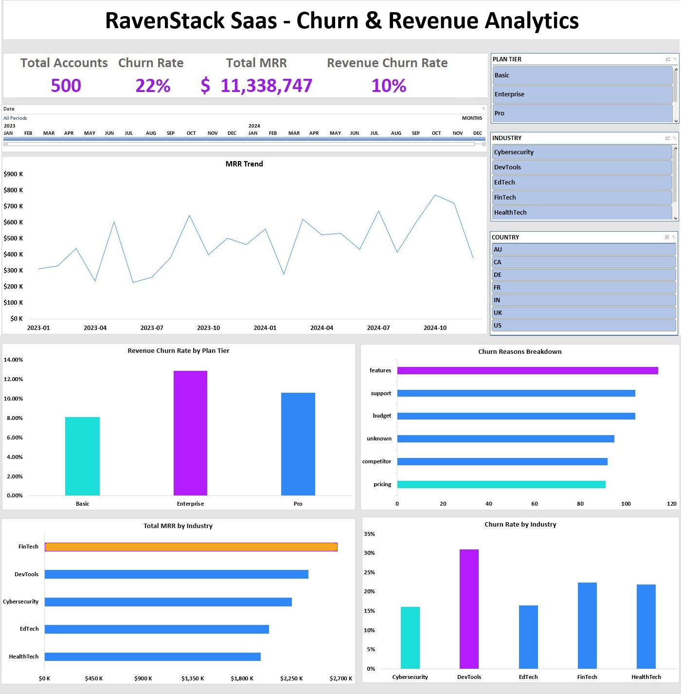
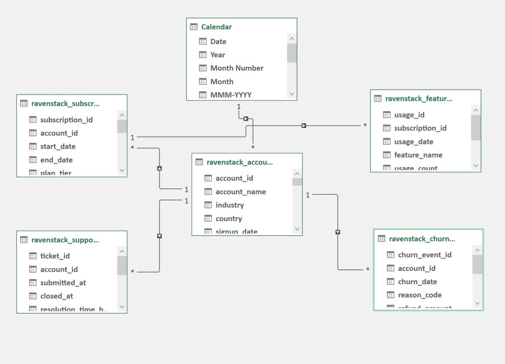
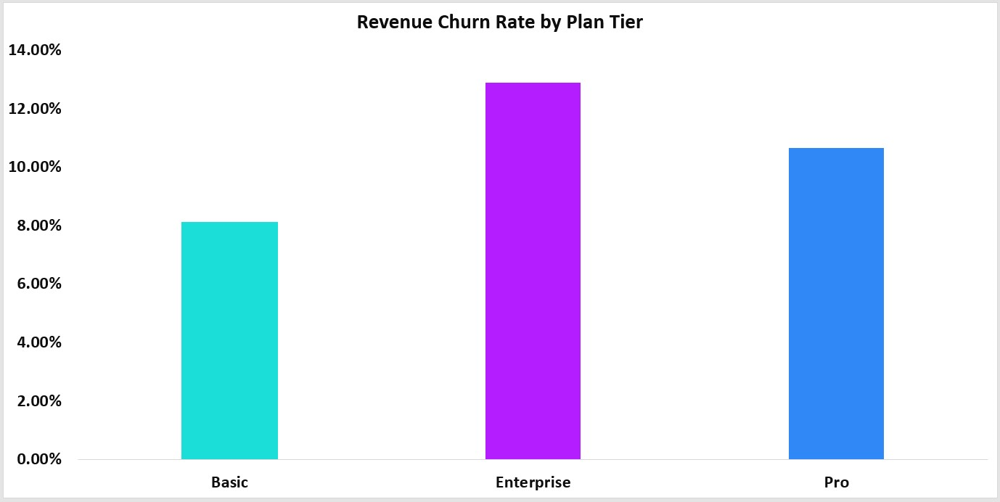
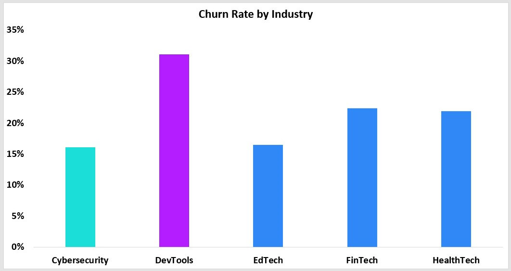
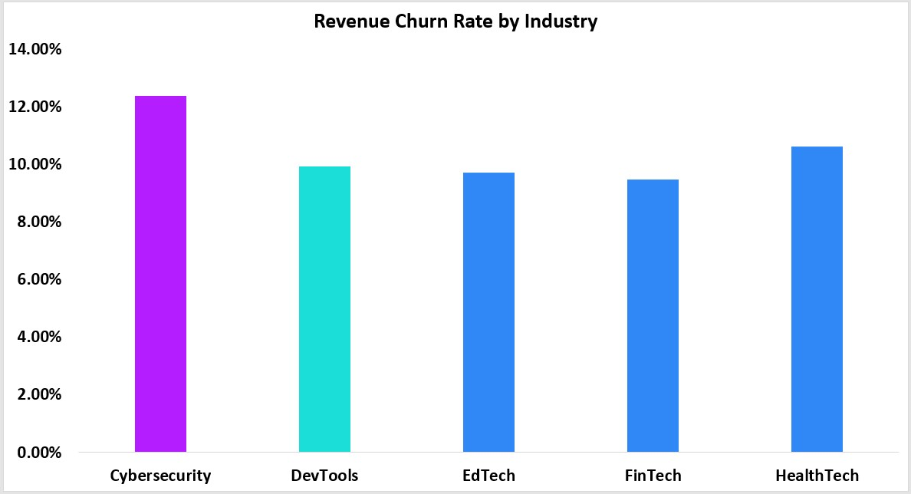
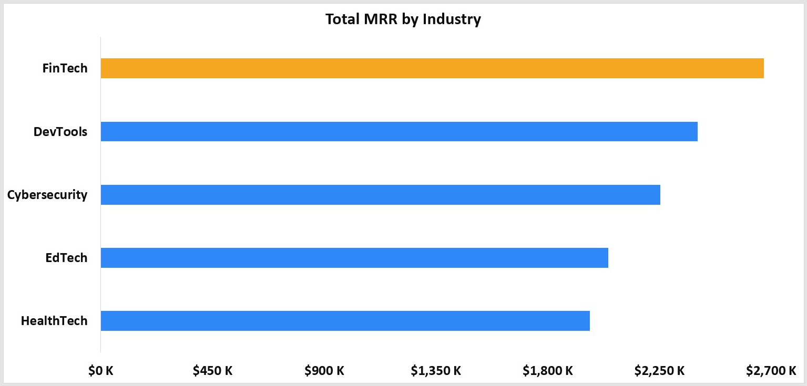
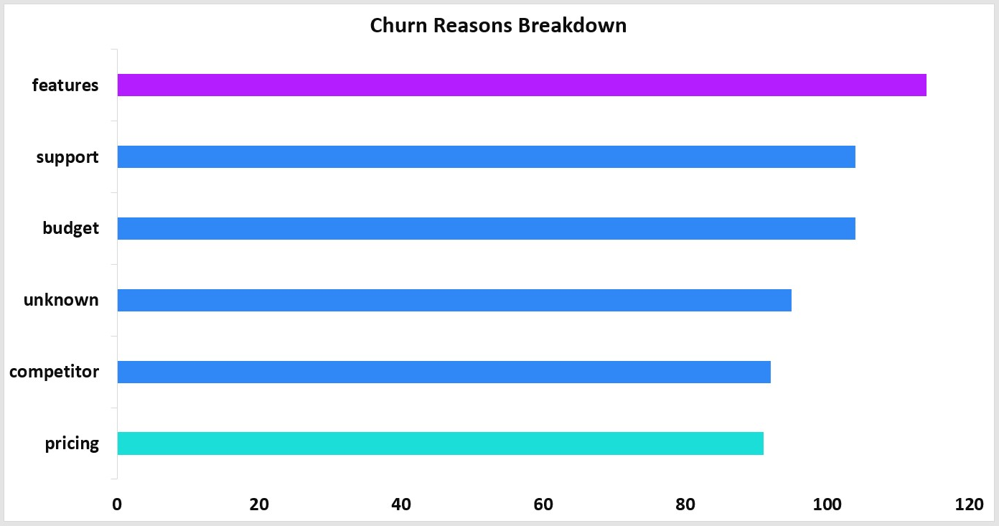
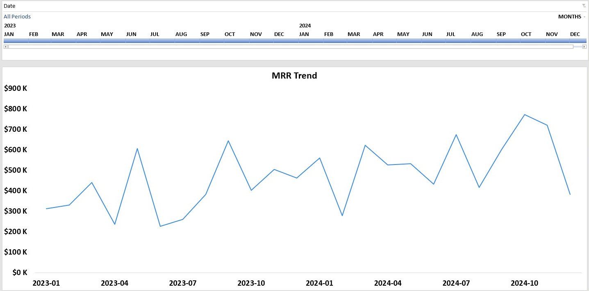

# RavenStack SaaS: Subscription Churn & Revenue Retention Analysis

An end-to-end analytics project built entirely in Excel using Power Query, Power Pivot (DAX), and an interactive Pivot-based dashboard. The project looks at where churn is concentrated at a B2B SaaS company, what drives it, and what it costs in revenue. Along the way it tests three hypotheses about how churn relates to product engagement and support quality.

 

---

## Table of Contents

- [Project Overview](#project-overview)
- [Business Context](#business-context)
- [Problem Statement](#problem-statement)
- [Data](#data)
- [Data Model](#data-model)
- [Methodology](#methodology)
- [Key Findings](#key-findings)
- [Recommendations](#recommendations)
- [Dashboard Guide](#dashboard-guide)
- [Limitations & Caveats](#limitations--caveats)
- [Repository Structure](#repository-structure)
- [Tools & Skills Demonstrated](#tools--skills-demonstrated)

---

## Project Overview

| | |
|---|---|
| **Project title** | RavenStack SaaS: Subscription Churn & Revenue Retention Analysis |
| **Author** | Abdulaziz Abidzhanov |
| **Date completed** | May-27, 2026 |
| **Tools used** | Microsoft Excel: Power Query (M), Power Pivot (DAX), Pivot Tables, Pivot Charts, Timeline & Slicers |
| **Dataset source** | [Kaggle: SaaS Subscription & Churn Analytics Dataset (rivalytics)](https://www.kaggle.com/datasets/rivalytics/saas-subscription-and-churn-analytics-dataset/data) |
| **Project type** | Dashboard plus exploratory analysis (single-tool, Excel) |

---

## Business Context

RavenStack is an AI-powered collaboration platform serving 500 accounts across five industries, running a B2B software-as-a-service model. For a subscription business like RavenStack, churn is the metric that matters most. Even a small drop in the monthly churn rate compounds into a large revenue difference over time. This project works through two years of subscription, support, and usage data (January 2023 to December 2024) to find where churn is concentrated and what predicts it.

---

## Problem Statement

Churn is the core challenge for RavenStack, as it is for most subscription businesses. Some churn is unavoidable, but the goal is always to keep it as low as possible. This analysis sets out to find the most-churned customer segments and the main reasons behind their churn, so management can target retention work where it will actually pay off.

The work is built around three questions:

1. **Which customer segments churn the most, and why?** This combines account attributes with the logged churn reasons.
2. **Does product engagement predict churn?** This tests whether feature usage and error rates differ between churned and retained accounts.
3. **Does support experience drive churn?** This tests whether resolution time, satisfaction, and escalation rates differ between churned and retained accounts.

One distinction runs through the whole project: **customer churn** (how many accounts leave) versus **revenue churn** (how much recurring revenue leaves). As the findings show, those two measures do not always point in the same direction.

---

## Data

The dataset is five related tables covering RavenStack's accounts, subscriptions, churn events, product usage, and support operations.

| Table | Rows | Grain | Key fields | Role in analysis |
|---|---|---|---|---|
| `ravenstack_accounts` | 500 | One row per account | `account_id`, `industry`, `country`, `plan_tier`, `referral_source`, `signup_date`, `churn_flag` | Customer **dimension**, drives all segmentation |
| `ravenstack_subscriptions` | 5,000 | One row per subscription | `subscription_id`, `account_id`, `mrr_amount`, `arr_amount`, `is_trial`, `churn_flag`, `billing_frequency` | Revenue **fact** table |
| `ravenstack_churn_events` | 600 | One row per churn event | `account_id`, `churn_date`, `reason_code`, `refund_amount_usd`, `is_reactivation` | Churn root-cause **fact** table |
| `ravenstack_feature_usage` | 25,000 | One row per usage record | `subscription_id`, `feature_name`, `usage_count`, `error_count` | Engagement **fact** table |
| `ravenstack_support_tickets` | 2,000 | One row per ticket | `account_id`, `resolution_time_hours`, `priority`, `satisfaction_score`, `escalation_flag` | Support-health **fact** table |

**Categorical reference:** 3 plan tiers (Basic, Pro, Enterprise), 5 industries (Cybersecurity, DevTools, EdTech, FinTech, HealthTech), 7 countries (US, UK, DE, FR, IN, CA, AU), 6 churn reasons (pricing, support, budget, features, competitor, unknown), and 40 distinct product features.

---

## Data Model

The five tables were loaded into the Power Pivot data model and arranged as a **star schema**, with `ravenstack_accounts` as the central dimension. A separate **Calendar** table was built in DAX to drive time intelligence on the subscription revenue trend.

 

**Relationships**

| From (fact, many) | To (dimension, one) | Join key |
|---|---|---|
| `subscriptions` | `accounts` | `account_id` |
| `churn_events` | `accounts` | `account_id` |
| `support_tickets` | `accounts` | `account_id` |
| `feature_usage` | `subscriptions` | `subscription_id` (then chains to `accounts`) |
| `subscriptions` | `Calendar` | date |

**A note on the model.** `feature_usage` reaches `accounts` indirectly, through `subscriptions` via `subscription_id`. Power Pivot only allows one active filter path between any two tables, so the Calendar table connects to `subscriptions`, which is where MRR lives and where the time trend matters most. For churn-event dates, a `YYYY-MM` column was derived straight from the churn date inside Power Query and used to drive the churn trend charts directly.

---

## Methodology

The project ran in three stages: prepare, model, then deliver.

### 1. Data preparation (Power Query / M)

All five CSVs were loaded into the Power Query Editor, typed correctly, and transformed. The main work per table:

- **Accounts.** Added a `Cohort` column (signup year-month) for cohort grouping, plus a `Tenure (months)` column.
- **Subscriptions.** Added an active-versus-churned status column, a column for how long churned accounts stayed subscribed before they left, and filtered the table to non-trial subscriptions for the revenue measures.
- **Churn Events.** Added a `Has Feedback` (Yes/No) column from the feedback field, and derived a `YYYY-MM` column from the churn date for time-based analysis.
- **Feature Usage.** Corrected `usage_count` from text to a whole number. The table needed little else.
- **Support Tickets.** Added a `Rated vs Unrated` column so the satisfaction subset could be analysed on its own, added a `Resolution Time Category` column that buckets tickets by resolution hours, and corrected `first_response_time_minutes` from text to a decimal.

Three columns carried meaningful nulls, and each got a clear treatment:

- The 4,514 null `end_date` values in subscriptions mark active subscriptions, so they were kept and flagged through the status column.
- The 825 null `satisfaction_score` values (41%) were tagged as unrated, which let the rated tickets be analysed on their own.
- The 148 null `feedback_text` values (25%) were captured through the `Has Feedback` column so the feedback that exists stays usable.

### 2. Data modelling (Power Pivot / DAX)

A star schema was built (see [Data Model](#data-model)). Aggregated measures were calculated in the Power Pivot model, with all DAX measures in ` ravenstack_accounts` sheet in a Power Pivot space.

A few of the measures:

```dax
Total MRR =
CALCULATE ( SUM ( Subscriptions[mrr_amount] ), Subscriptions[is_trial] = FALSE )

Churn Rate =
DIVIDE ( [Churned Accounts], [Total Accounts] )

Revenue Churn Rate =
DIVIDE ( [Revenue Churned], [Total MRR] )

ARPU =
DIVIDE ( [Total MRR], [Active Accounts] )

Avg Features Used Per Account =
AVERAGEX (
    Accounts,
    CALCULATE (
        DISTINCTCOUNT ( FeatureUsage[feature_name] ),
        FILTER ( Subscriptions, Subscriptions[account_id] = EARLIER ( Accounts[account_id] ) )
    )
)

Escalation Rate =
DIVIDE (
    CALCULATE ( COUNTROWS ( SupportTickets ), SupportTickets[escalation_flag] = TRUE ),
    COUNTROWS ( SupportTickets )
)
```

> `Avg Features Used Per Account` needed an explicit bridge through the `Subscriptions` table, since feature usage only reaches accounts via the two-hop `subscription_id` to `account_id` path. The first few attempts returned 0.008, then 1, before the bridge fixed it.

Each measure was checked once it was written. Total Accounts returned 500, Churned Accounts returned 110, Churn Rate returned 22%, Total Subscriptions returned 4,222 once trials were filtered out, and the rest lined up with the row counts in the source files.

**Headline measures (model totals):**

| Measure | Value |
|---|---|
| Total Accounts | 500 |
| Churn Rate | 22% |
| Total MRR | $11,338,747 |
| Total ARR | $136,064,964 |
| ARPU | ~$29,074 |
| Revenue Churned | $1,179,139 |
| Revenue Churn Rate | 10.40% |
| Avg Features Used / Account | ~25 of 40 |
| Avg Error Rate | 5.63% |
| Avg Satisfaction Score | 3.98 / 5 |
| Escalation Rate | 4.75% |

### 3. Insight delivery (Pivot Charts and an interactive dashboard)

Three working sheets (`Work_Churn`, `Work_Revenue`, `Work_Engagement`) were used to build and check the Pivot Tables for each question. A clean `Dashboard` sheet then pulls the key visuals together, driven by Plan Tier, Industry, and Country slicers plus a date Timeline.

---

## Key Findings

> The numbers below are outputs from the model. Where a chart shows the finding, a placeholder marks where to drop it in.

### 1. Customer churn is flat across plan tiers, but revenue churn is not

All three plan tiers churn at the same 22% customer rate, which rules out the usual assumption that cheaper plans churn more. Revenue churn is a different story: Enterprise 12.87%, Pro 10.65%, Basic 8.12%. Enterprise accounts leave at the same rate as everyone else, but each one that leaves takes far more recurring revenue with it.



### 2. DevTools is the highest-churn industry by customer count

DevTools churns at 31%, roughly double Cybersecurity and EdTech (both around 16%), with FinTech and HealthTech sitting near the 22% average. This is the clearest customer-churn segmentation signal in the data.



### 3. Customer churn and revenue churn point at different industries

The industry that loses the most accounts is not the one that loses the most revenue. DevTools has the highest customer churn at 31%, yet its revenue churn rate (around 9.9%) sits below average, so the DevTools accounts that leave tend to be low-value. Cybersecurity is the mirror image: the lowest customer churn (16%) but the highest revenue churn rate (around 12.4%), so its rare departures are expensive ones. This contrast is the most useful result in the project, and a single churn-rate number would hide it completely.




### 4. No single dominant churn reason

The six logged churn reasons are spread surprisingly evenly, each landing between roughly 15% and 19%, with features highest at 19% and budget and support tied around 17.3%. Churn here comes from a mix of factors, with no single cause standing out as the one to fix.



### 5. Product engagement does not predict churn (hypothesis rejected)

The expectation going in was that disengaged users churn. The data says otherwise. Churned accounts actually used slightly more features (around 26 versus 25) and had lower error rates (5.37% versus 5.68%) than retained accounts. Engagement breadth does not predict churn in this dataset.

### 6. Support experience does not meaningfully predict churn (hypothesis rejected)

The support metrics barely move between churned and retained accounts: resolution time around 35.7h versus 35.9h, satisfaction 4.01 versus 3.97, escalation 5.56% versus 4.53%. Churned accounts had much the same support experience as everyone else.

**What this adds up to.** Churn at RavenStack does not track with how customers use the product or how they are supported. It tracks better with commercial factors (pricing, budget, competitor, feature gaps) that sit fairly evenly across the base. The bigger business risk is the value of who churns, the high-MRR Cybersecurity and Enterprise accounts, more than the headline count, which DevTools leads.

### Revenue is growing

Setting churn aside, MRR grew strongly over the period, from roughly $300K per month in early 2023 to over $750K by late 2024, with clear year-over-year gains.



---

## Recommendations

1. **Build a renewal watchlist for high-MRR accounts.** Enterprise and Cybersecurity accounts cost the most when they leave, so flag the largest accounts and give them named owners, scheduled check-ins, and early renewal conversations. Saving one large account here is worth more than saving several small ones.

2. **Run win-back interviews with churned DevTools accounts.** DevTools loses the most customers, and the data does not say why. Talk to a sample of the accounts that left to learn whether the product fits their workflow, whether the entry price is wrong, or whether this segment is simply low-value and not worth heavy retention spend.

3. **Test pricing and packaging before investing in usage or support fixes.** Engagement and support look the same for churned and retained accounts, so nudging usage or tightening support SLAs is unlikely to change the churn number. The stated reasons point at pricing, budget, and competitors, so that is where to experiment first.

4. **Make the churn reason a required field at cancellation.** A quarter of churn records have no written feedback, and the coded reasons split evenly, which leaves the real story thin. Capturing a short mandatory reason and an optional comment at cancellation will give the next analysis something firmer to work with.

---

## Dashboard Guide

The `Dashboard` sheet is the main deliverable. It holds:

- **KPI cards** along the top: Total Accounts, Churn Rate, Total MRR, Revenue Churn Rate.
- **MRR Trend** (line): monthly recurring revenue, January 2023 to December 2024.
- **Revenue Churn Rate by Plan Tier** (bar): shows the Enterprise revenue-churn finding.
- **Churn Reasons Breakdown** (bar): how the six logged reasons split.
- **Total MRR by Industry** (bar): where revenue concentrates.
- **Churn Rate by Industry** (bar): shows the DevTools finding.

**Interactivity.** Three slicers (Plan Tier, Industry, Country) and a date Timeline filter the visuals. The slicers are wired across the relevant Pivot Charts, so one selection updates several views at once. The churn-reason charts filter on the churn table's own date column, for the modelling reason described above.

---

## Limitations & Caveats

- **Simulated data.** This is a synthetic Kaggle dataset, so the patterns here may not match real-world SaaS behaviour and should not be generalised.
- **Partial satisfaction sample.** 41% of support tickets have no satisfaction score, so any satisfaction conclusion rests on the rated subset only.
- **Incomplete churn feedback.** A quarter of churn events have no free-text feedback, so the qualitative reason analysis is partial.
- **Anonymised features.** Features are labelled generically, so the engagement findings cannot be tied to specific parts of the product or turned into product recommendations.
- **Event counts and account counts differ.** There are 600 churn events but 110 accounts flagged as churned. Some accounts have several events (including 61 reactivations), so the event-level and account-level figures are separate and should not be mixed.
- **Small country samples.** Some countries have few accounts (Germany has around 25), so their churn percentages swing easily and should be read with that in mind.

---

## Repository Structure

```
.
├── data/
│   ├── ravenstack_accounts.csv
│   ├── ravenstack_subscriptions.csv
│   ├── ravenstack_churn_events.csv
│   ├── ravenstack_feature_usage.csv
│   └── ravenstack_support_tickets.csv
├── reports/
│   └── RavenStack_Churn_Analysis.xlsx        <!-- the finished workbook -->
└── visuals/
    ├── dashboard_overview.png
    ├── data_model.png
    ├── mrr_trend.png
    ├── churn_rate_by_industry.png
    ├── revenue_churn_by_plan.png
    ├── churn_reasons.png
    └── mrr_by_industry.png
├── README.md
```
## Tools & Skills Demonstrated

- **Power Query (M):** multi-source ingestion, type correction, calculated columns, categorical bucketing, null handling, and documented query steps.
- **Power Pivot (DAX):** star-schema design, relationship management (including a two-hop bridge through the subscriptions table), a dedicated measures table, and measures using iterator functions (`AVERAGEX`) and filter context (`CALCULATE`, `FILTER`, `DIVIDE`).
- **Data modelling:** a dimensional star schema with a custom DAX Calendar table for time intelligence.
- **Visualisation and communication:** an interactive Pivot-chart dashboard with slicers and a timeline, KPI cards, and a findings narrative that keeps customer churn and revenue churn separate.
- **Analytical judgement:** three hypotheses tested, two of them rejected on the evidence, and the results reported as they came out.

---

**Author:** Abdulaziz Abidzhanov | https://www.linkedin.com/in/abdulaziz-abidzhanov-62656b343/ 

**Last updated:** May-27, 2026
